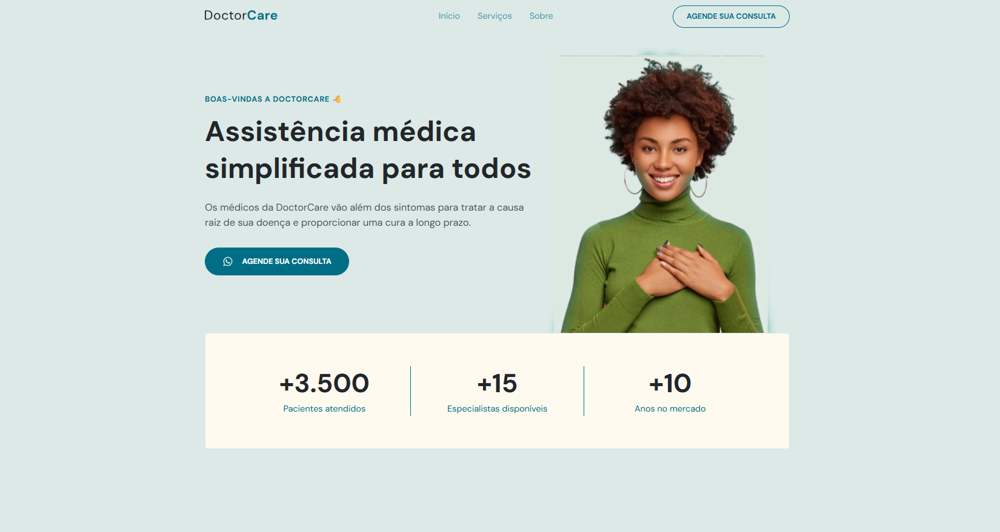

  

DoctorCare é uma página institucional no formato One Page, responsiva, para usar em diversos tipos de micros, pequenas e médias empresas. Contém as seguintes seções: Header, Navigation, Home, Sobre, Serviços e Footer

## 🎨 Layout

O layout da aplicação está disponível no [Figma](https://www.figma.com/design/pnBp4b7gvpme7vCElqxf7g/DoctorCare--Community---Copy-?node-id=120-3&p=f&t=QdpYrmZFkBOHVZgQ-0)

## 📸 Preview do Projeto

    

## 🚀 Tecnologias

- **[HTML](https://www.w3.org/html/)** - Linguagem de marcação para criar interfaces web
- **[CSS](https://www.w3.org/Style/CSS/)** - Linguagem para construção de interfaces web
- **[JavaScript](https://javascript.org/)** - Superset tipado do JavaScript
- **[ScrollReveal](https://scrollrevealjs.org/)** - Biblioteca de scroll reveal

## 📝 Licença

Este projeto está sob a licença MIT. Veja o arquivo [LICENSE](LICENSE) para mais detalhes.

# 🧑🏻‍💻 Autor

Feito com ❤️ por Gelzieny R. Martins 👋🏽 [Entre em contato!](https://gelzieny-dev.vercel.app/)

---

⭐ Se este projeto foi útil, considere dar uma estrela!

